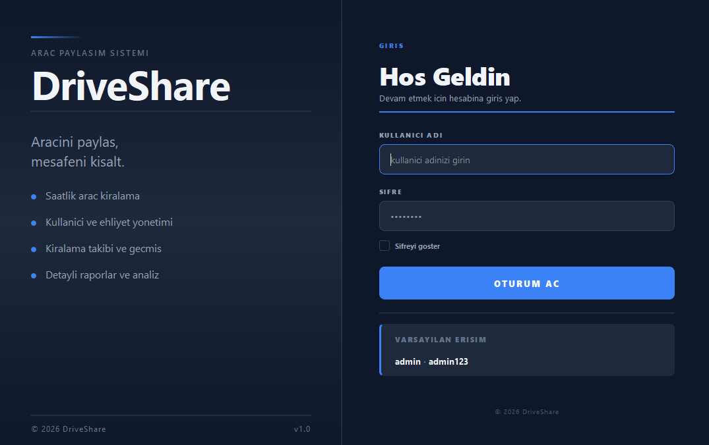
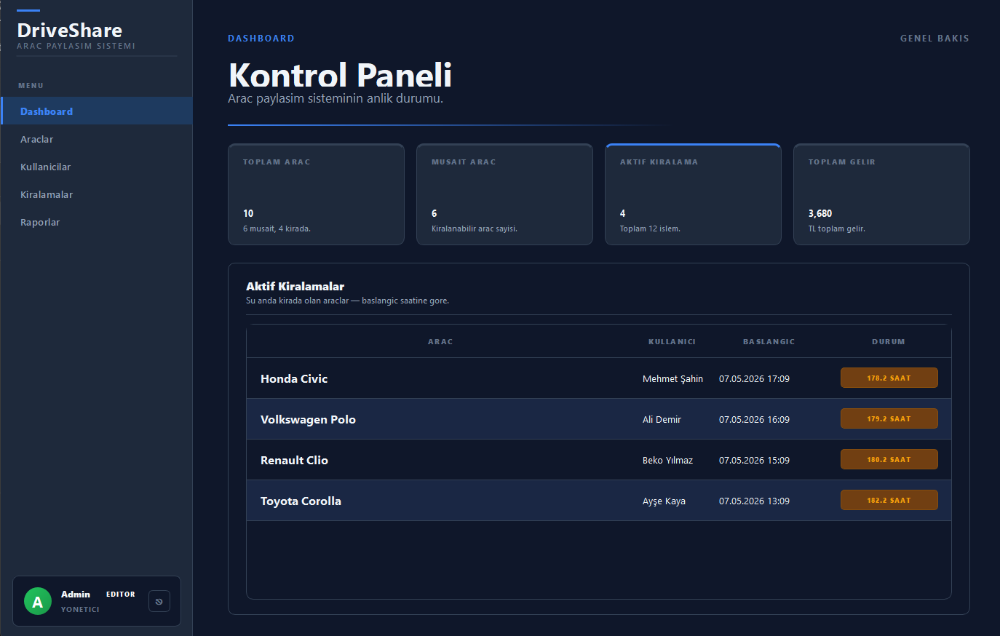
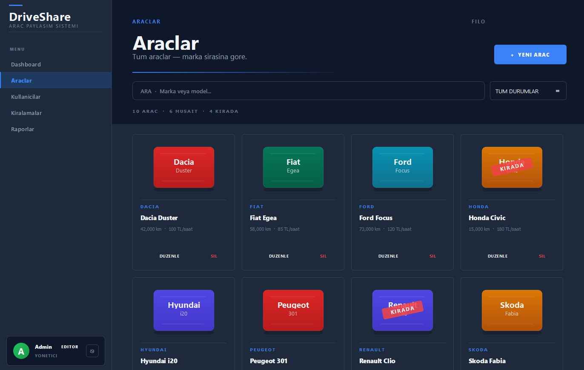
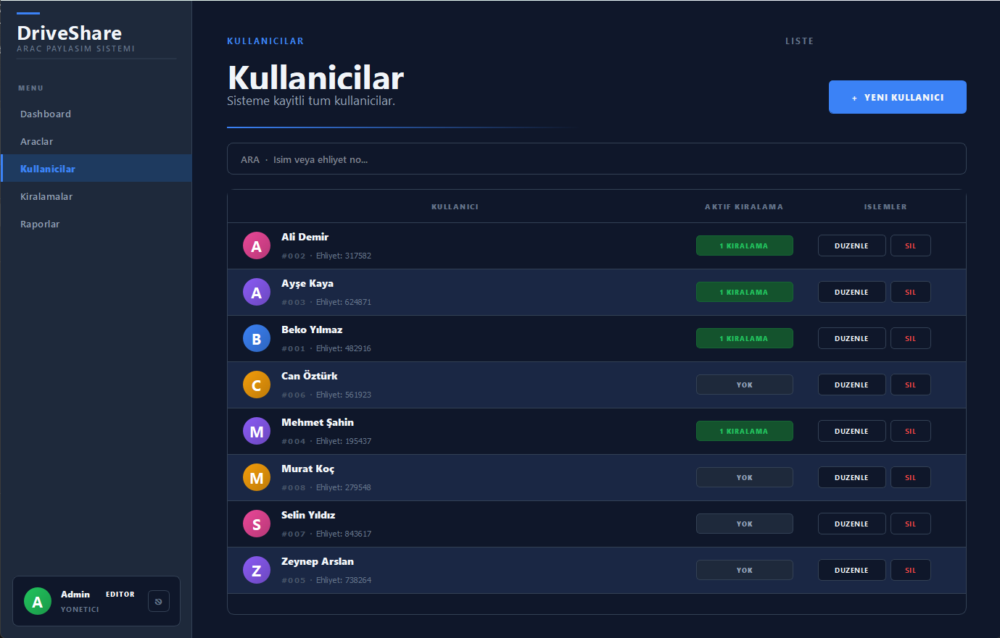
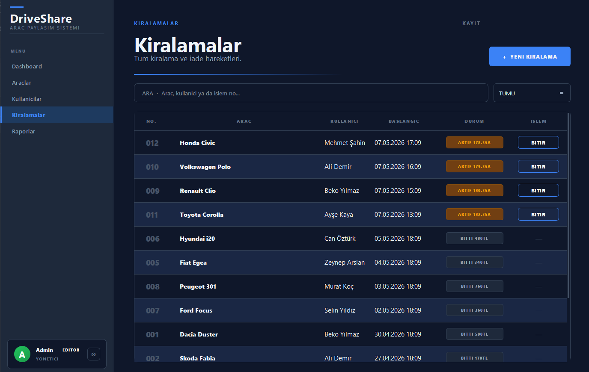
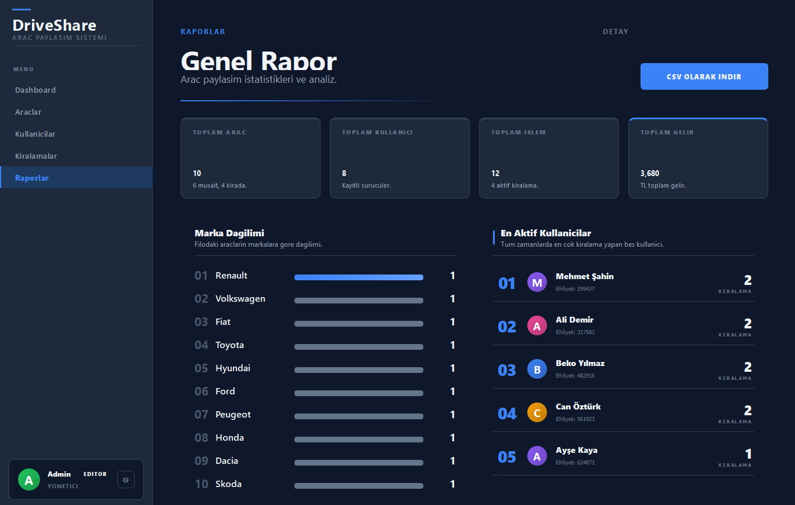

# DriveShare - Arac Paylasim Sistemi

Araclarin saatlik kiralanabildigi, kullanici ve kiralama takibini saglayan masaustu uygulamasidir. PyQt5 ile editorial/gazete tarzinda bir arayuz sunar.

## Teknolojiler

- **Python 3** - Programlama dili
- **PyQt5 (>=5.15.0)** - Masaustu GUI framework
- **JSON** - Veri kaliciligi
- **PBKDF2-HMAC-SHA256** - Sifre guvenligi

## Proje Yapisi

    PROJE 1 - Arac Paylasim Sistemi/
    ├── main.py                          # Ana giris noktasi
    ├── requirements.txt                 # Bagimliliklar
    ├── backend/
    │   ├── veri_yoneticisi.py          # CRUD islemleri ve istatistikler
    │   ├── arac.py                     # Arac modeli
    │   ├── kullanici.py                # Kullanici modeli
    │   ├── kiralama.py                 # Kiralama islemi modeli
    │   ├── auth.py                     # Kimlik dogrulama
    │   └── seed.py                     # Ornek veri yukleme
    ├── frontend/
    │   ├── ana_pencere.py              # Ana pencere
    │   ├── login.py                    # Giris ekrani
    │   ├── tema.py                     # Editorial tema
    │   ├── views/
    │   │   ├── dashboard.py            # Kontrol paneli
    │   │   ├── araclar.py              # Arac yonetimi
    │   │   ├── kullanicilar.py         # Kullanici yonetimi
    │   │   ├── kiralamalar.py          # Kiralama islemleri
    │   │   └── raporlar.py             # Istatistikler ve raporlar
    │   └── widgets/
    │       ├── bilesenler.py           # UI bilesenleri
    │       └── diyaloglar.py           # Modal diyaloglar
    ├── images/                          # Ekran goruntuleri
    └── data/
        ├── araclar.json
        ├── kullanicilar.json
        ├── kiralamalar.json
        └── sistem_kullanicilari.json

## Ana Siniflar

### Arac (`backend/arac.py`)

- **Ozellikler:** `arac_id`, `marka`, `model`, `kilometre`, `musait_mi`, `saatlik_ucret`
- **Metodlar:** Durum guncelleme, kilometre guncelleme

### Kullanici (`backend/kullanici.py`)

- **Ozellikler:** `kullanici_id`, `ad`, `ehliyet_no` (6 haneli, benzersiz)
- **Metodlar:** Kiralama gecmisi filtreleme

### Kiralama (`backend/kiralama.py`)

- **Ozellikler:** `kiralama_id`, `arac_id`, `kullanici_id`, `baslangic_saati`, `bitis_saati`
- **Metodlar:** Kiralama baslatma/bitirme, sure hesaplama, tutar hesaplama, aktif kontrolu

## Ozellikler

- **Dashboard:** 4 metrik (Toplam Arac, Musait Arac, Aktif Kiralama, Toplam Gelir) + aktif kiralama tablosu + durum rozetleri (yesil/sari/kirmizi)
- **Arac Yonetimi:** Ekleme, guncelleme, silme, durum takibi, marka/musaitlik filtresi
- **Kullanici Yonetimi:** Ehliyet no dogrulama (6 haneli), cift ehliyet engelleme, kiralama gecmisi
- **Kiralama Islemleri:** Arac kiralama, iade etme, otomatik sure ve tutar hesaplama, atomik islem (rollback destekli)
- **Raporlar:** Marka dagilimi (bar grafik), en aktif kullanicilar top 5, toplam gelir, CSV export
- **Tasarim:** Editorial/gazete temasi - kagit beyazi (#fdfdfb), murekkep siyahi, editoryal kirmizi accent

## Ekran Goruntuleri

### Giris Ekrani

### Kontrol Paneli

### Arac Yonetimi

### Kullanici Yonetimi

### Kiralama Islemleri

### Raporlar

## Kurulum ve Calistirma

    pip install -r requirements.txt
    python main.py

## Varsayilan Giris

- **Kullanici adi:** `admin`
- **Sifre:** `admin123`

## Ornek Veri

Ilk calistirmada 10 arac, 8 kullanici ve 12 kiralama kaydi otomatik olusturulur.
